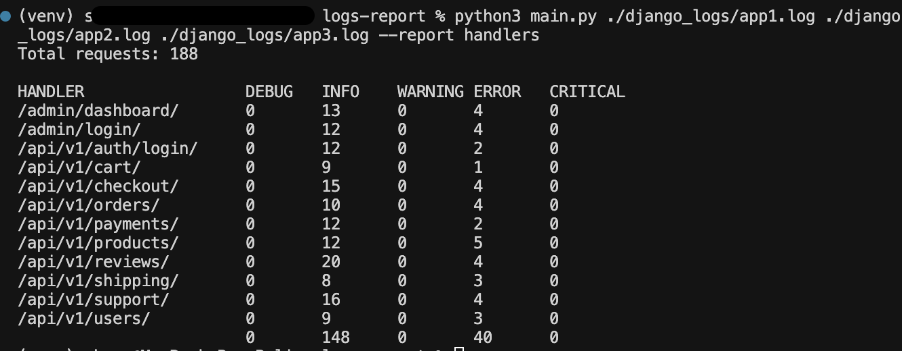
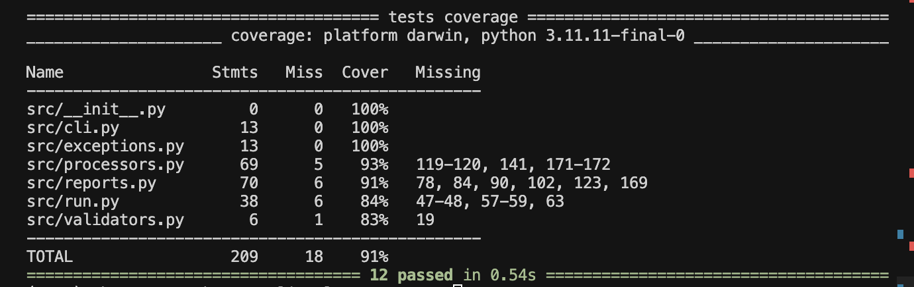

# Django Logs Report Generator
CLI Приложение командной строки для анализа логов Django с поддержкой параллельной обработки и гибкой системой отчетов.


## 🚀 Быстрый старт

1. Клонировать репозиторий:
```bash
git clone https://github.com/LynnG3/logs-report.git
cd logs-report
```

2. Создать и активировать виртуальное окружение:
```bash
# для Unix/macOS
python3 -m venv venv
source venv/bin/activate

# для Windows
python -m venv venv
venv\Scripts\activate
```

3. Установить зависимости:
```bash
pip install -r requirements.txt
```

4. Запуск:
```bash
python main.py ./django_logs/app1.log --report handlers

```

5. Запуск тестов:
```bash
pytest tests/ -v --cov=src --cov-report=term-missing
```

## 📋 Возможности

- Параллельная обработка множества лог-файлов
- Поддержка всех компонентов Django логов
- Форматированный вывод отчетов
- Надежная обработка ошибок

### Ключевые компоненты
####    LogParser
    - Парсинг всех типов логов Django
    - Универсальные регулярные выражения
    - Расширяемая система обработки компонентов
####    LogProcessor
    - Параллельная обработка через multiprocessing
    - Эффективная агрегация данных
    - Оптимизированное использование памяти
#### HandlersReport
    Форматированный вывод в табличном виде
    Гибкая система шаблонов
    Поддержка различных форматов отчетов


## 📊 Примеры

# Анализ нескольких файлов

в корне проекта: 
```bash
python main.py ./django_logs/*.log --report handlers
```

<p align="center">
  
</p>

<p align="center">
  
</p>

🔧 Разработка
- Добавление нового типа отчета
- Добавить компонент в DjangoLogComponent
- Создать паттерн для парсинга
- Обновить parse_log_line
- Создать класс отчета

## 📝 Тeхнические требования

- Python 3.11+
- pytest
- pytest-cov


## 📝 License

MIT License

